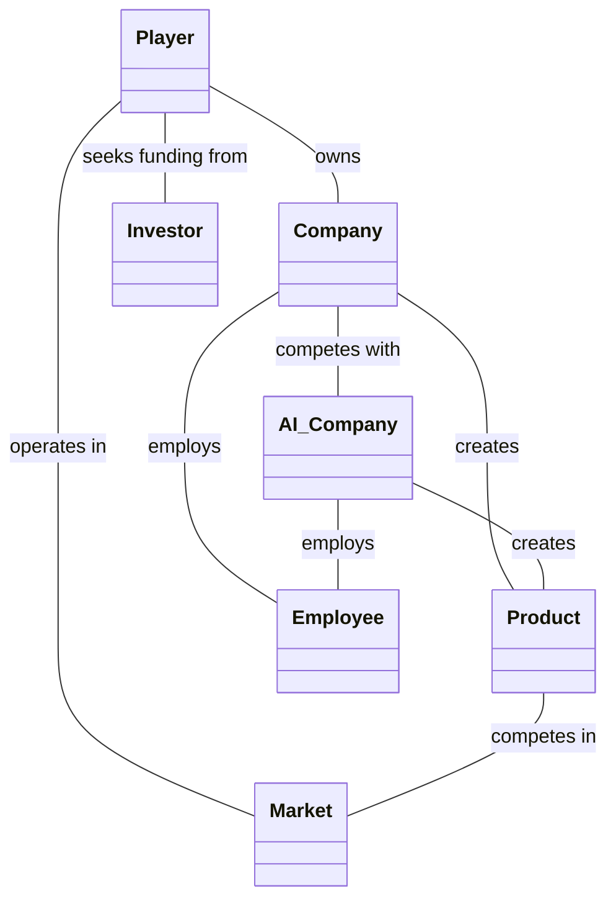
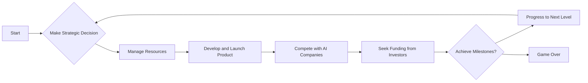

# Game Overview:
### Title:
Tech Startup Simulator (working title)

### Genre:
Business Simulation

### Platform:
PC (with potential for porting to mobile and console platforms)
 
### Description:
Tech Startup Simulator is a business simulation game where players take on the role of an entrepreneur building a tech startup from scratch.\
The game focuses on strategic decision-making, resource management, and competitive gameplay, as players navigate the challenges of the tech industry.

## Gameplay:
The core gameplay loop involves players making strategic decisions to manage their startup's operations and growth.

This includes developing and launching new products, conducting market research, allocating resources, running marketing campaigns, hiring and managing employees, and securing funding from investors.

Players will manage resources such as capital, human resources, intellectual property, and time. The management of these resources will be critical for the startup's success and growth.

The game will feature AI competitors representing rival startups. These competitors will compete with the player for market share, talent, and funding.

### Story and Setting:
The game follows the journey of an aspiring tech entrepreneur,\
starting from the early days of a small startup and progressing towards building a successful tech empire.\
The narrative will include key milestones, achievements, and challenges that the player encounters along the way.

### Art and Aesthetics:
The game will feature a modern and sleek design aesthetic, with clean and minimalist UI elements, vibrant colors, and futuristic visuals.

(We'll develop more specific art assets and UI design in the development phase.)

### Sound and Music:
The game will feature ambient and background music to enhance the atmosphere and mood of the game.\
Sound effects will be used to highlight important gameplay events and actions.

### Technical Specifications:
The game will be developed using Unity, with potential for deployment on multiple platforms including PC, mobile, and consoles.

### Monetization and Marketing:
The game will be sold as a premium product, with potential for additional revenue through in-game purchases or DLC. Marketing strategies will include online advertisements, social media campaigns, and partnerships with influencers in the gaming community.

This is a preliminary version of the Design Document. As we continue to refine our game's concept and begin the technical design and development, we'll continue to update and expand this document.

Next, we'll move on to the Technical Design  I'll create a simple class diagram to outline the structure of our game. Here's a basic example to get us started:

This is a very basic structure and we'll likely need to add more classes and relationships as we delve deeper into the technical design of our game. For example, we might want to add classes for different types of employees, products, or investors.
Now, let's move on to the flowchart for our core gameplay loop. Here's a basic example:

## Class Diagram:
Here's a basic structure of classes and their relationships:

Player class with attributes such as capital, knowledge, and experience. The Player owns a Company and operates in a Market.

Company class with attributes such as employees, products, and intellectualProperty. The Company creates Products and employs Employees. It competes with AI_Company.

Product class with attributes such as developmentCost, marketValue, and competitiveness. The Product competes in the Market.

Employee class with attributes such as salary, productivity, and morale.

AI_Company class similar to the Company class, but controlled by the game's AI.

Market class with attributes such as marketTrends, consumerDemands, and competitorProducts.

Investor class with attributes such as investmentAmount and returnExpectations.

## Flowchart for Core Gameplay Loop:
Here's a basic structure of the core gameplay loop:

# Start
Make a strategic decision (e.g., develop a new product, conduct market research, allocate resources, start a marketing campaign, hire new employees, seek funding from investors) \
Manage resources (e.g., financial capital, human resources, intellectual property, R&D budget, marketing budget, time) \
Develop and launch a product \
Compete with AI companies \
Seek funding from investors \
Check if milestones are achieved \
If yes, progress to the next level and return to "Make a strategic decision" \
If no, game over 
