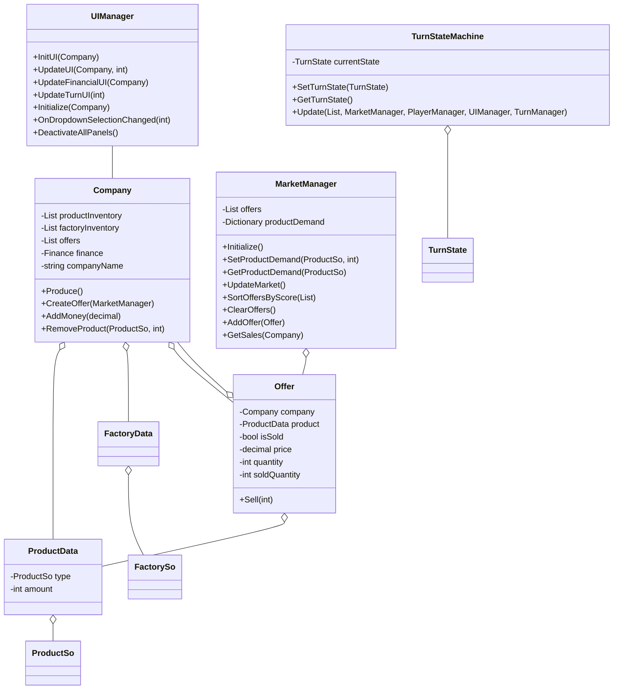
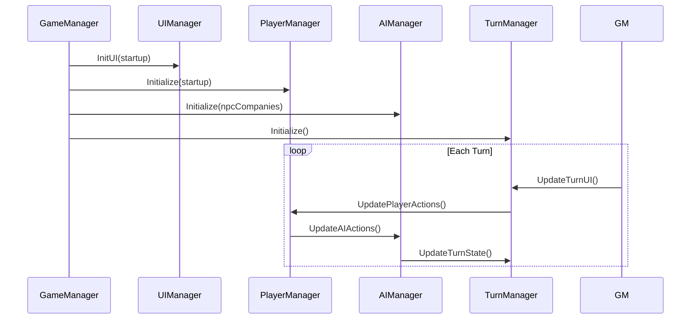


# Design Document for Business Tycoon Game

## Game Description

Business Tycoon is a simulation game where players and AI opponents run their
companies, competing against each other in a dynamic market. Each turn, players
manage various aspects of their company, including production, marketing,
financing, and budgeting. After taking their actions, they progress to the next
quarter.

## Game Phases

1. **Planning Phase**: Player chooses an option from the dropdown menu and makes
   decisions based on the selected panel.
2. **Execution Phase**: The game implements the player's decisions and updates
   the game state.
3. **AI Turn**: AI companies take their turn.
4. **Evaluation Phase**: The game evaluates the results of the quarter and
   updates the game state accordingly.

## Game Components

1. **Companies**: Player and AI run companies, which are the main entities of
   the game. Each company has a balance, product inventory, and factory
   inventory.

2. **UIManager**: Manages the User Interface, including dropdown menu, financial
   display, and updates panels based on player actions.

3. **AIManager**: Manages the AI companies' actions.

4. **PlayerManager**: Manages player actions.

5. **MarketManager**: Manages the game's market, including offers from different
   companies.

6. **TurnManager**: Manages the game's turns and updates the game state.

7. **TurnStateMachine**: Controls the game's phases (Planning, Execution, AI
   Turn, Evaluation).

8. **GameManager**: Central manager that orchestrates the other components.

## Player's Actions

Players can perform the following actions through different panels:

1. **Market**: Players can view the current market offers and make new offers.
2. **Research**: Players can conduct research to improve their products or
   processes.
3. **Production**: Players can manage their production facilities, producing
   products based on their current inventory.
4. **Financing**: Players can view their financial status, take loans, and pay
   them back.
5. **Contracts**: Players can view and manage their contracts with other
   companies.
6. **Budgeting**: Players can set their operational budget and cash flow budget.
7. **Reports**: Players can view reports of their company's performance.

Once the player has taken all the actions they want, they can proceed to the
next quarter.

---
## Class Diagran

## Sequence Diagram for Turn Progression

