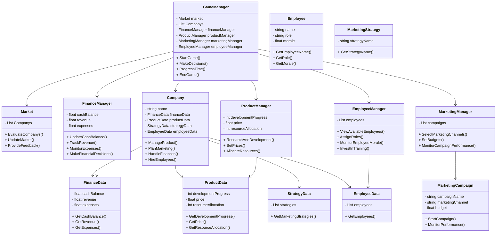
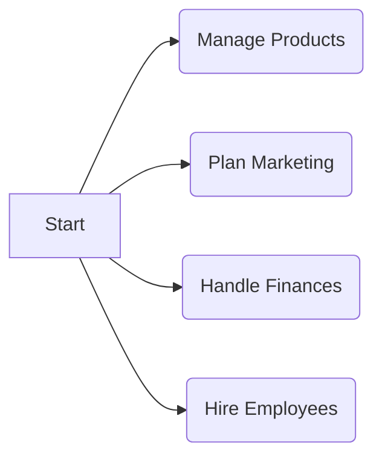
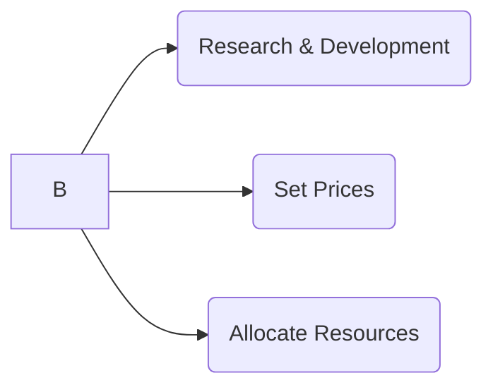
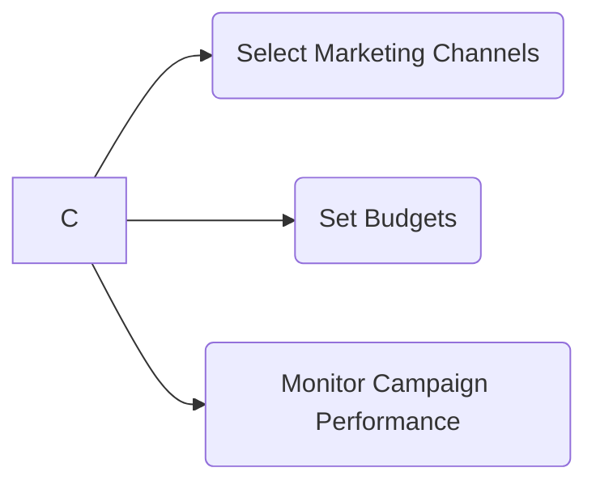
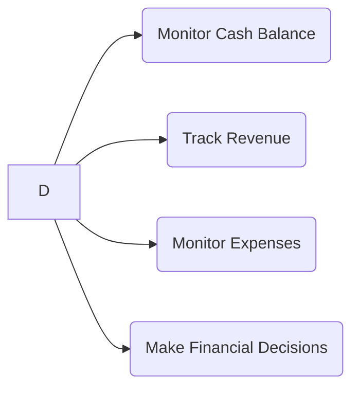
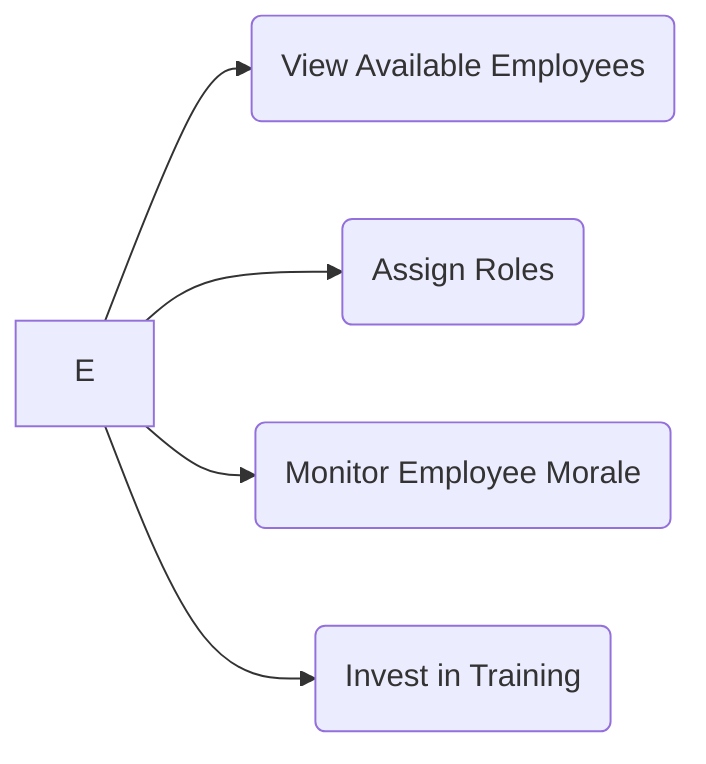
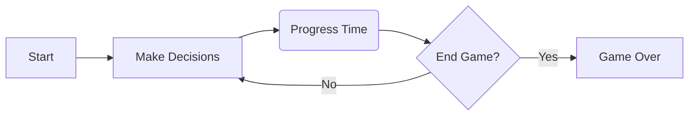
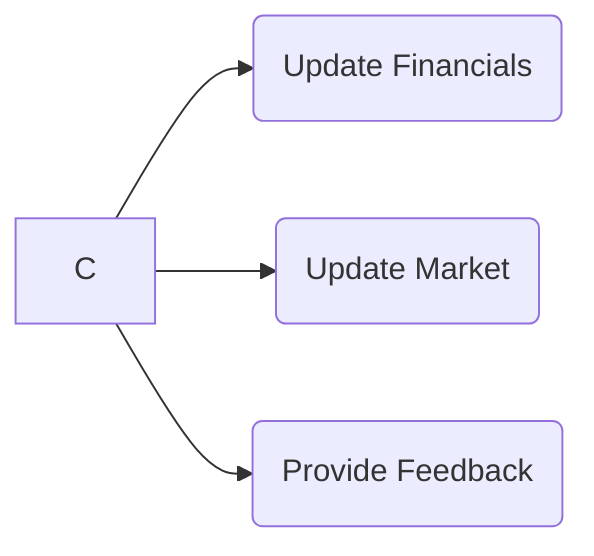

# Game Overview:

## Class Diagram:

The business simulator game aims to provide players with a realistic experience of managing their own Company company in a competitive market environment. Players will navigate various aspects of entrepreneurship, including product development, marketing strategies, financial management, and employee hiring.

Manage Products:
In this aspect of the game, players will be able to develop, launch, and manage their products. They will have the option to invest in research and development, set prices, and allocate resources for product improvement.

Plan Marketing:
Players will strategize and execute marketing campaigns to promote their products and attract customers. They can choose from various marketing channels, set budgets, and monitor campaign performance.

Handle Finances:
Financial management is a crucial aspect of the game. Players will monitor their cash balance, revenue, expenses, and overall financial health. They can make decisions on investments, loans, and cost-cutting measures.

Hire Employees:
Players will have the opportunity to build a strong team by hiring employees with different skills and expertise. They can assign roles, monitor employee morale and productivity, and invest in training and development.

The game will feature a dashboard that displays important metrics and provides an overview of the Company's performance, including cash balance, revenue, expenses, employee morale, and product feedback.

Game Flow:

The game flow follows a quarterly or monthly timeline. At the beginning of each period, players will make strategic decisions in product development, marketing, financial management, and employee hiring. As time progresses, the outcomes of their decisions will be reflected in the Company's performance and financials.

Players will receive feedback on their product sales, customer satisfaction, market trends, and competitors' activities through in-game notifications and event updates.

Progress Time:
Time will progress as players navigate through the game, and the decisions they make will influence the outcomes. At the end of each period, the game will calculate financial results, update market conditions, and provide relevant feedback.

Players can set goals and milestones for their Company, such as reaching a specific valuation, launching new products, or achieving profitability. The game will provide achievements and rewards for reaching these milestones.

MVP (Minimum Viable Product):

The MVP will focus on the core functionalities required to simulate a business Company experience. It will include the following features:

Ability to develop and manage products.
Execute basic marketing campaigns.
Monitor cash balance, revenue, and expenses.
Hire and manage employees.
Display key metrics and financial information.
The MVP will provide a basic user interface with essential elements and functionality to deliver a playable and engaging experience.
