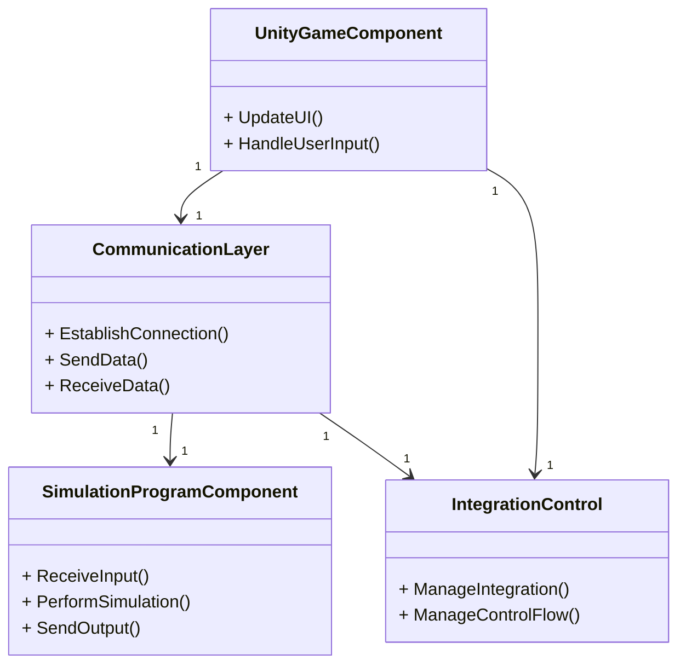
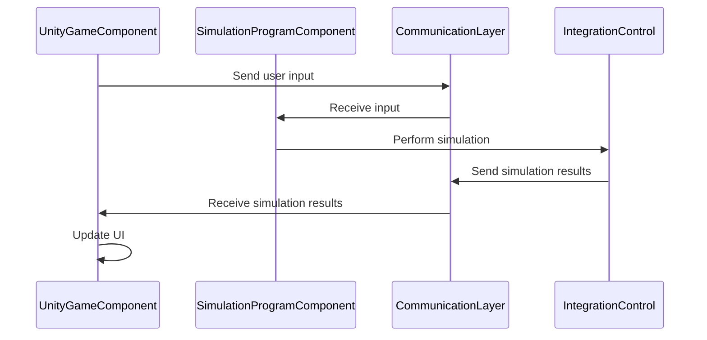
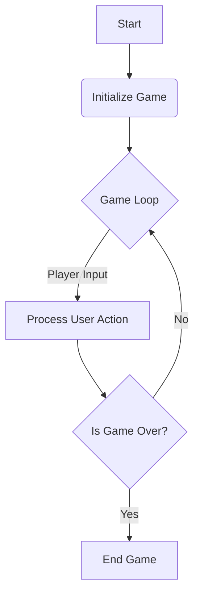
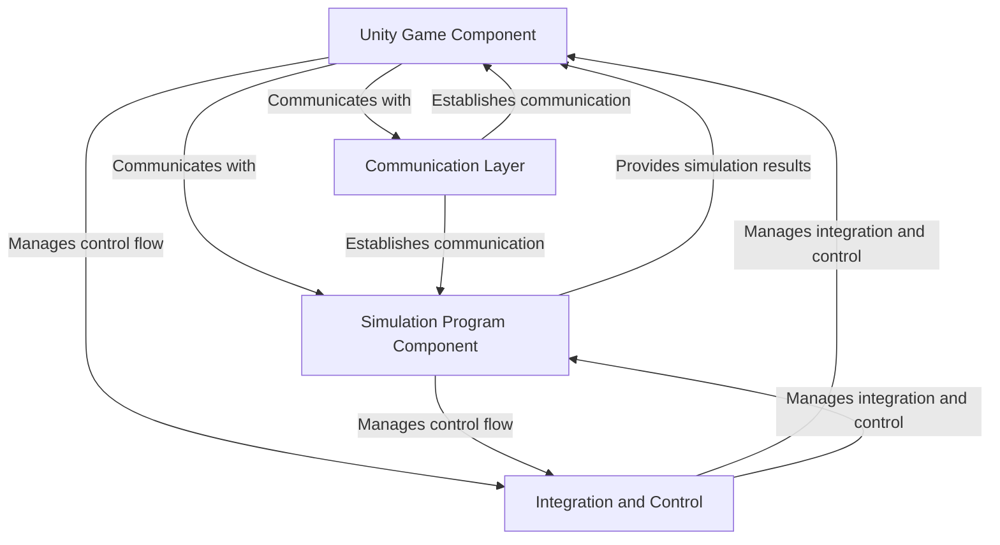
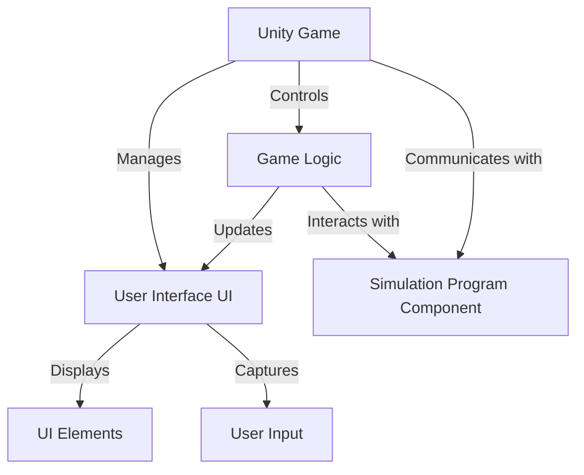

# Diagrams
## Class Diagram

```mermaid
classDiagram
    class UnityGameComponent {
        + UpdateUI()
        + HandleUserInput()
    }

    class SimulationProgramComponent {
        + ReceiveInput()
        + PerformSimulation()
        + SendOutput()
    }

    class CommunicationLayer {
        + EstablishConnection()
        + SendData()
        + ReceiveData()
    }

    class IntegrationControl {
        + ManageIntegration()
        + ManageControlFlow()
    }

    UnityGameComponent "1" --> "1" CommunicationLayer
    UnityGameComponent "1" --> "1" IntegrationControl
    CommunicationLayer "1" --> "1" SimulationProgramComponent
    CommunicationLayer "1" --> "1" IntegrationControl

```

## Sequence Diagram

```mermaid
sequenceDiagram
    participant UnityGameComponent
    participant SimulationProgramComponent
    participant CommunicationLayer
    participant IntegrationControl

    UnityGameComponent ->> CommunicationLayer: Send user input
    CommunicationLayer ->> SimulationProgramComponent: Receive input
    SimulationProgramComponent ->> IntegrationControl: Perform simulation
    IntegrationControl ->> CommunicationLayer: Send simulation results
    CommunicationLayer ->> UnityGameComponent: Receive simulation results
    UnityGameComponent ->> UnityGameComponent: Update UI

```
## Activity Diagram

```mermaid
graph TD
    A[Start] --> B(Initialize Game)
    B --> C{Game Loop}
    C -->|Player Input| D[Process User Action]
    D --> E{Is Game Over?}
    E -- No --> C
    E -- Yes --> F[End Game]
```
## Component Diagram

```mermaid
graph TD
    A[Unity Game Component] -- Communicates with --> B[Simulation Program Component]
    B -- Provides simulation results --> A
    A -- Communicates with --> C[Communication Layer]
    C -- Establishes communication --> A
    C -- Establishes communication --> B
    D[Integration and Control] -- Manages integration and control --> A
    D -- Manages integration and control --> B
    A -- Manages control flow --> D
    B -- Manages control flow --> D
```
## Ground Up Diagram

```mermaid
graph TD
    A[Unity Game] -- Manages --> B[User Interface UI]
    A -- Controls --> C[Game Logic]
    A -- Communicates with --> D[Simulation Program Component]
    B -- Displays --> E[UI Elements]
    B -- Captures --> F[User Input]
    C -- Updates --> B
    C -- Interacts with --> D
```
