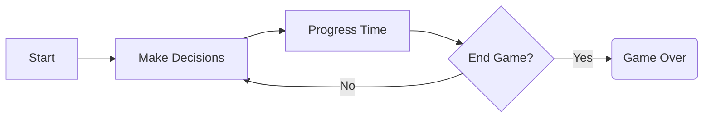
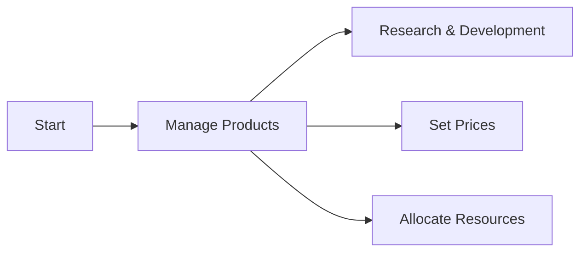
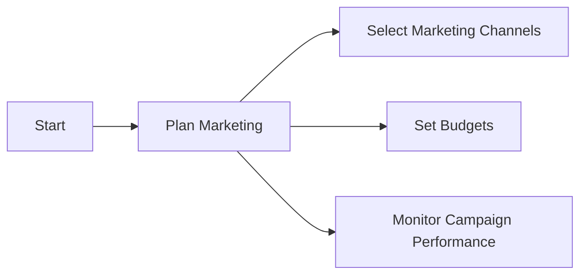
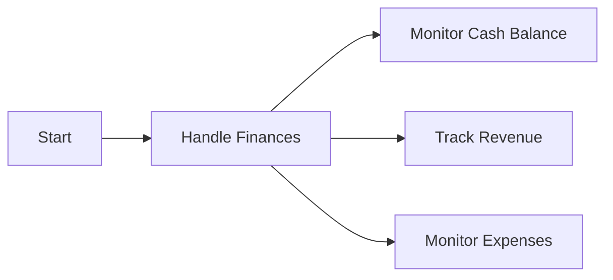
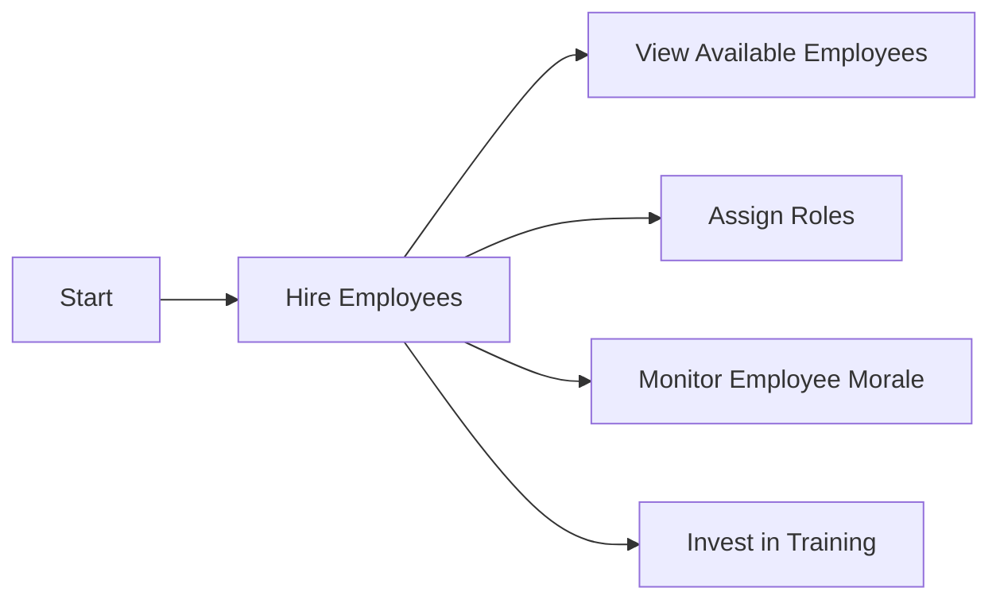
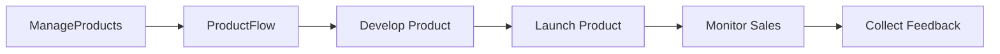



# Game Flow:

# Manage Products:

# Plan Marketing:

# Handle Finances:

# Hire Employees:

# Product Flow:

These separate graphs represent the individual aspects of the game, including the game flow, managing products, planning marketing, handling finances, hiring employees, and the flow of a product from development to feedback collection.

You can refer to each graph to understand the specific logic and flow of that aspect in more detail.
